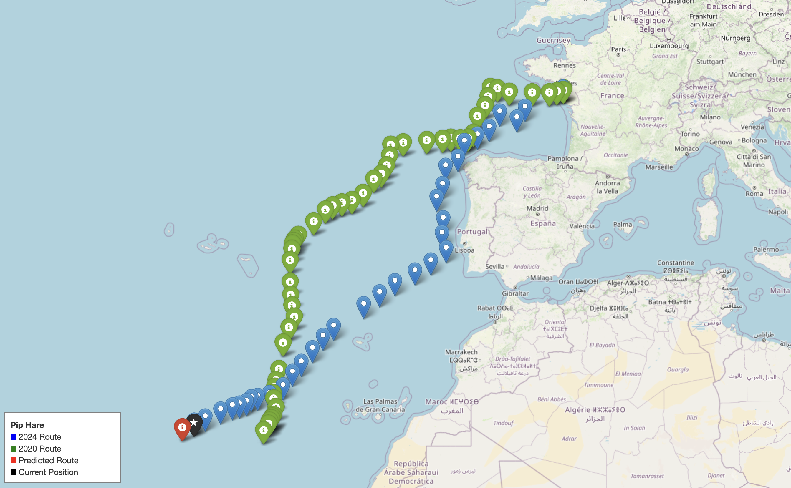

# Vendée Globe 2024 (WIP)
A predictive modeling project to analyze and forecast the routes of boats participating in the ongoing Vendée Globe 2024 race.
This project uses historical Vendée Globe 2020 race data to test if a machine learning model can learn the decision-making of skippers, based on the wind direction and location (latitude and longitude). The aim is for the model to predict the direction (bearing) a boat will take in the ongoing 2024 race on the following day based on the wind direction on the current day. The project includes wind data fetching, data processing, modeling, and visualization of both observed and predicted routes.


**Disclaimer**
This is a work in progress that I am undertaking during my maternity leave to enhance my own enjoyment of following the Vendée Globe 2024 even further. I am making the repository public in case someone else wants to save resources in obtaining the data while the race is ongoing. The fate of this project solely depends on whether I survive the 4-month sleep regression ^_^

## Overview
This project collects, processes, and models data from the Vendée Globe 2024 race to gain insights and make route predictions for participating skippers.

2020 Vendee globe routes enhanced with wind and temperature data are used to train a simple ML model that predicts how far the skipper will make it the next day. 

The project uses 2020 Vendée Globe routes, enhanced with wind and temperature data, to train a simple machine learning (ML) model that predicts the routes of skippers participating in the ongoing Vendée Globe 2024.

You can:
1. Download the latest 2024 Vendée Globe data (see the instructions below).
2. Enrich the 2024 data with wind information (see the instructions below).
3. Use the 2020 routes data with the wind (available in `data/2020`) to train the ML model and predict the next day of routes for a 2024 skipper of your choice (notebook /predict_vendee.ipynb)

Workflow:
- Data Preprocessing: Clean and preprocess race data, including geospatial (latitude/longitude) and wind information.
- Feature Engineering:
- - Calculate bearings (direction).
- - Generate lagged features for past movements.
- - Compute wind alignment and travel distances.
- Machine Learning:
- - Predict next-day positions using Random Forest.
- - Evaluate model accuracy using metrics like MAE
- Visualization:
- - Interactive maps with Folium.
- - Static visualizations with Matplotlib and Cartopy.

  

*Example visualization of predicted skipper routes.*

To view the full interactive map, open `docs/predicted_route.html` in your browser.

---
## DATA
In the `data/` directory, you can find Vendée Globe 2024 and 2020 routes enriched with wind data.  
Details on how this data was obtained and processed are provided below.


---
## Fetching Data
### Vendee Globe routes 2024
To fetch the Vendée Globe 2024 routes data from [https://www.vendeeglobe.org/classement](https://www.vendeeglobe.org/classement), run the following command:

```bash
python src/get_2024_routes.py
```

#### Parameters
The script requires the following parameters:

- **`reports`**: A list containing the range of report numbers `[reports_start, reports_end]` specifying the period to fetch data for:
  - **`reports_start`**: The report number corresponding to the first day and time of the race. For example, the URL `https://www.vendeeglobe.org/classement?report=74` corresponds to **10.11.2024 15h**, so `reports_start` would be `74`.
  - **`reports_end`**: The report number corresponding to the last day and time to fetch. 

#### Example
To fetch data from the start of the race on **10.11.2024 15h** (`report=74`) to 16.11.2024 19h (`report=134`), pass the `reports` parameter as:

```bash
python src/get_2024_routes.py --reports [74, 134]
```
#### Notes
- The script will most likely stop working once the webpage is updated for the next race.

- If you encounter errors while reading the Excel files with Python, try opening and saving them again using a spreadsheet application like Microsoft Excel or LibreOffice.

### Download Vendee Globe 2020 data
You can download 2020 data from https://www.bislins.ch/walti/bloge/index.asp?page=Media%3AVendee+Globe+Race+GPS+Data%2Ezip

## Preparing the Data for Modeling
To enhance route data with wind data for certain checkpoint times, there are two separate scripts for the 2020 and 2024 data:

### For 2020 Data:
Run the following script to add the wind information to the 2020 Vendée Globe data:
```bash
python src/ranking_history_with_wind_2020.py
```
The scripts will add the following columns to the route data:

- **`temp`**: Temperature at the skipper's location.
- **`windgust`**: Wind gust speed at the skipper's location.
- **`windspeed`**: Wind speed at the skipper's location.
- **`winddir`**: Wind direction at the skipper's location.

To enable fetching wind data from the Visual Crossing Weather API:

1. Obtain an API key from [Visual Crossing Weather](https://www.visualcrossing.com/).
2. Store the API key in a separate file (e.g., `api_key.txt`).
3. Specify the path to the API key file in the `src/functions/get_data.py` script.

### For 2024 Data:
Coming soon...

